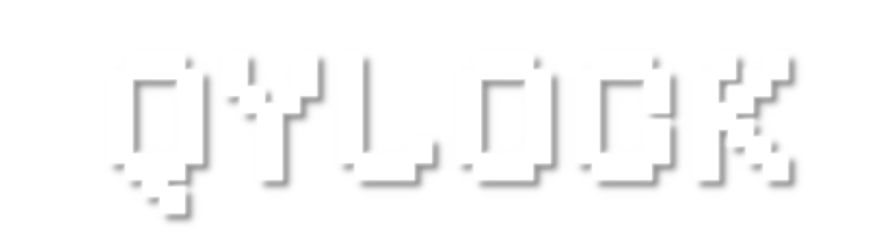

<p align="center">
  
</p>

<div align="center">

```ocaml
A COZY COLLECTION OF COZY LOCKSCREEN THEMES FOR SDDM AND QUICKSHELL
```

</div>

<pre align="center">
<a href="#sddm-setup">SDDM</a> • <a href="#quickshell-setup">QUICKSHELL</a> • <a href="#gallery">GALLERY</a> • <a href="#credits">CREDITS</a>
</pre>

<h1>
  <a href="#---------1">
    
  </a>
  <a href="#---------2">
    
  </a>
  <a href="#---------3">
    
  </a>
</h1>


<h2>HELLOWW!</h2>

Welcome to Qylock! Thank you for stopping by!

<br>

---

<br>

<h2 align="center">SDDM SETUP</h2>

<details>
<summary><b>View Dependencies</b></summary>
<br>

| | Packages |
|--:|:---|
| **Core** | `sddm` `qt5-graphicaleffects` `qt5-quickcontrols2` `qt5-svg` |
| **Video · Qt5** | `qt5-multimedia` |
| **Video · Qt6** | `qt6-multimedia-ffmpeg` |
| **GStreamer** | `gst-plugins-base` `gst-plugins-good` `gst-plugins-bad` `gst-plugins-ugly` |
| **Optional** | `fzf` |

</details>

<details>
<summary><b>View Font Requirements</b></summary>
<br>

Some themes rely on fonts that cannot be bundled here (copyright issues). Download the font and drop it into `themes/<theme_name>/font/` — it loads automatically.

| Theme | Font | Filename |
|--:|:---|:---|
| NieR: Automata | FOT-Rodin Pro DB | `FOT-Rodin Pro DB.otf` |
| Terraria | Andy Bold | `Andy Bold.ttf` |
| Genshin Impact | HYWenHei-85W | `zhcn.ttf` |
| Sword | The Last Shuriken | `The Last Shuriken.ttf` |
| Minecraft | Minecraft Regular | `minecraft.ttf` |

</details>

#### INSTALLATION
```sh
chmod +x sddm.sh && ./sddm.sh
```

> The script uses `fzf` for an interactive theme picker. Falls back to a numbered list if it is not installed.

<br>

---

<br>

<h2 align="center">QUICKSHELL SETUP</h2>

<details>
<summary><b>View Dependencies</b></summary>
<br>

| | Packages |
|--:|:---|
| **Core** | `quickshell` `qt6-declarative` `qt6-5compat` |
| **Video** | `qt6-multimedia` `qt6-multimedia-ffmpeg` |
| **GStreamer** | `gst-plugins-base` `gst-plugins-good` `gst-plugins-bad` `gst-plugins-ugly` |
| **Optional** | `fzf` |

</details>

#### SHORTCUT BINDING
Point your Window Manager keybind (e.g., in Hyprland, Qtile, Sway, or i3) directly to:
```sh
~/.local/share/quickshell-lockscreen/lock.sh
```

#### INSTALLATION
```sh
chmod +x quickshell.sh && ./quickshell.sh
```

<br>

---

<br>

<div align="center">

```ocaml
CLICK OR VIEW AN IMAGE IN THE GALLERY FOR FULL PREVIEW
```

</div>

<h2 align="center">GALLERY</h2>

<br>

<div align="center">
  <table style="border-collapse: collapse; border: none;">
    <tr>
      <td align="center" width="50%" style="padding: 15px; border: none;">
        <b>Pixel · Coffee</b><br><br>
        
      </td>
      <td align="center" width="50%" style="padding: 15px; border: none;">
        <b>Pixel · Dusk City</b><br><br>
        
      </td>
    </tr>
    <tr>
      <td align="center" width="50%" style="padding: 15px; border: none;">
        <b>Pixel · Emerald</b><br><br>
        
      </td>
      <td align="center" width="50%" style="padding: 15px; border: none;">
        <b>Pixel · Hollow Knight</b><br><br>
        
      </td>
    </tr>
    <tr>
      <td align="center" width="50%" style="padding: 15px; border: none;">
        <b>Pixel · Munchax</b><br><br>
        
      </td>
      <td align="center" width="50%" style="padding: 15px; border: none;">
        <b>Pixel · Night City</b><br><br>
        
      </td>
    </tr>
    <tr>
      <td align="center" width="50%" style="padding: 15px; border: none;">
        <b>Pixel · Rainy Room</b><br><br>
        
      </td>
      <td align="center" width="50%" style="padding: 15px; border: none;">
        <b>Pixel · Skyscrapers</b><br><br>
        
      </td>
    </tr>
    <tr>
      <td align="center" width="50%" style="padding: 15px; border: none;">
        <b>NieR: Automata</b><br><br>
        
      </td>
      <td align="center" width="50%" style="padding: 15px; border: none;">
        <b>Terraria</b><br><br>
        
      </td>
    </tr>
    <tr>
      <td align="center" width="50%" style="padding: 15px; border: none;">
        <b>Enfield</b><br><br>
        
      </td>
      <td align="center" width="50%" style="padding: 15px; border: none;">
        <b>Sword</b><br><br>
        
      </td>
    </tr>
    <tr>
      <td align="center" width="50%" style="padding: 15px; border: none;">
        <b>Paper</b><br><br>
        
      </td>
      <td align="center" width="50%" style="padding: 15px; border: none;">
        <b>Windows 7</b><br><br>
        
      </td>
    </tr>
    <tr>
      <td align="center" width="50%" style="padding: 15px; border: none;">
        <b>Cyberpunk</b><br><br>
        
      </td>
      <td align="center" width="50%" style="padding: 15px; border: none;">
        <b>TUI</b><br><br>
        
      </td>
    </tr>
    <tr>
      <td align="center" width="50%" style="padding: 15px; border: none;">
        <b>Porsche</b><br><br>
        
      </td>
      <td align="center" width="50%" style="padding: 15px; border: none;">
        <b>Genshin Impact</b><br><br>
        
      </td>
    </tr>
    <tr>
      <td align="center" colspan="2" style="padding: 15px; border: none;">
        <b>Ninja Gaiden</b><br><br>
        
      </td>
    </tr>
  </table>
</div>

<br>

---

<br>

<h2 align="center">CREDITS</h2>

| | |
|:--|:--|
| ☕ **[max](https://ko-fi.com/B0B1UPVVB)** | Genuinely blown away — thank you! |
| **Pumphium** | Theme suggestions, testing, and late-night debugging. |
| **Qt / QML Community** | The framework powering every theme in this collection. |
| **Unixporn** | Endless aesthetic inspiration and community feedback. |

<br>

---

<br>

<div align="center">
  <p><i>Make your login your own.</i></p>
  <a href="https://ko-fi.com/darkkal">
    
  </a>
</div>

<br>
